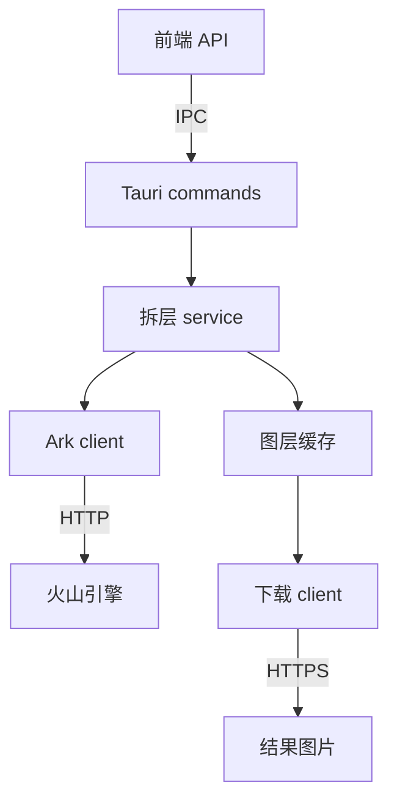

# 图层分离模块

图层分离通过前端 API 入口调用 Tauri command。界面组件只负责编辑器状态和结果写入，不直接依赖供应商请求细节。



- `src/api/layer-decomposition.ts`：前端 API 适配器，封装 `invoke`、二进制返回值和进度通道。
- `src-tauri/src/commands/decomposition.rs`：IPC 边界，只转换 Tauri 请求和响应。
- `src-tauri/src/services/decomposition.rs`：编排暂存、请求、下载和结果登记。
- `src-tauri/src/clients/ark.rs`：Ark endpoint、鉴权、请求体、响应解析和供应商错误映射。
- `src-tauri/src/clients/download.rs`：校验模型返回的 HTTPS 地址并流式读取图层。
- `src-tauri/src/clients/http.rs`：连接池配置、超时、重定向策略和网络错误转换。API 鉴权按请求设置，下载图片不携带 API Key。
- `src-tauri/src/decomposition/cache.rs`：暂存输入、缓存输出图层和清理任务目录。
- `src-tauri/src/decomposition/validation.rs`：输入图片、边界框和下载结果校验。
- `src-tauri/src/decomposition/types.rs`：IPC 数据和供应商转换后的业务结果类型。

service、client 和 cache 不依赖 Tauri；command 将 service 的进度回调转换成 `Channel` 消息。服务先完成配置和参数校验，再通知 `generating`；每张图片缓存成功后通知 `downloading`。生成请求不会自动重试，避免重复创建计费任务。

保持现有接口约定：输入为 PNG/JPEG 原始二进制，输出图层通过任务 ID 和素材 ID 读取；单图上限 30 MiB、任务总下载上限 200 MiB、下载并发上限 4。仅完整下载的任务会登记到缓存；失败时清理任务目录。

更换模型供应商时，优先替换 `clients/ark.rs` 并保持 `GeneratedLayers` 这个业务结果契约；编辑器和 Tauri command 不需要知道供应商的 JSON 格式。将来接入远程后端时，也可以在 `src/api` 增加 HTTP 实现，把当前 IPC 适配器作为桌面端实现保留。

项目持久存储继续使用 `src/lib/project-storage` 的仓库适配器；这里的缓存只保存拆层任务的临时结果，前端将结果写入项目素材后负责清理。

## 验证

```sh
pnpm build
pnpm lint
pnpm format:check
cargo test --manifest-path src-tauri/Cargo.toml --lib
```

Rust 回归测试覆盖本地模拟 HTTP 的请求和响应、上游错误映射、输入暂存消费、下载失败清理，以及图片、边界框和下载限制。模拟请求使用测试密钥，不读取开发环境密钥，也不调用真实模型服务。
